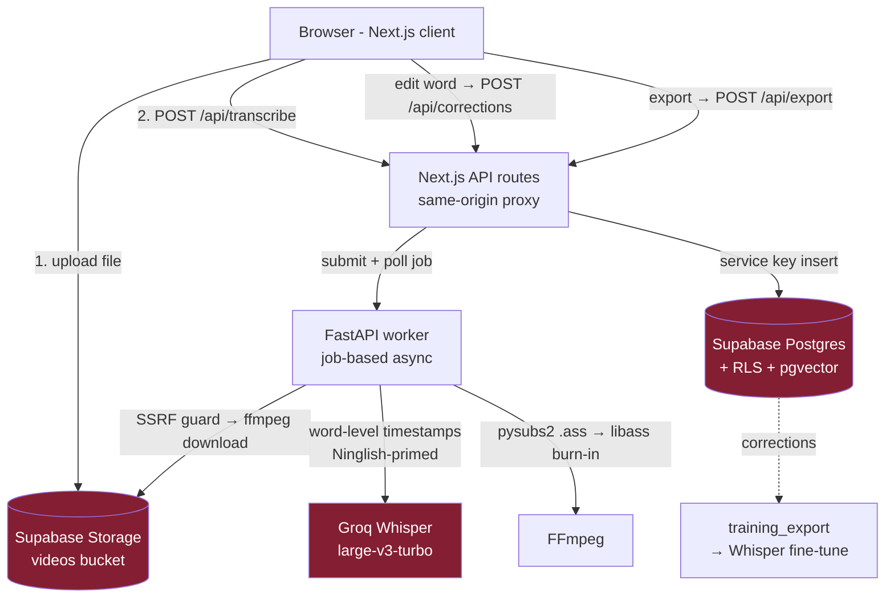

# Architecture — MVP

Simplified Phase-1 pipeline. No Inngest, no Modal, no R2 — Supabase + local FastAPI worker.

## System diagram



Stub mode: when `GROQ_API_KEY` / Supabase env are absent, the worker returns mock words
and routes degrade gracefully — the whole flow runs offline.


## Data flow

```
┌─────────────┐     1. upload video       ┌──────────────────────┐
│   Browser   │ ─────────────────────────▶│  Next.js (web/)      │
│  /upload    │                            │  app/api/upload      │
└─────────────┘                            └──────────┬───────────┘
       ▲                                              │ 2. store file
       │                                              ▼
       │                                   ┌──────────────────────┐
       │                                   │ Supabase Storage     │
       │                                   │ + videos row (DB)    │
       │                                   └──────────┬───────────┘
       │                                              │ 3. POST /transcribe
       │                                              ▼
       │                                   ┌──────────────────────┐
       │   6. preview/edit captions        │  Worker (worker/)    │
       │◀──────────────────────────────────│  FastAPI + FFmpeg    │
       │   (transcript JSONB word ts)      │                      │
       │                                   │  a. extract MP3      │
       │                                   │  b. Groq verbose_json│  ──▶ Groq API
       │                                   │     (word ts + Ning. │
       │                                   │      prompt)         │
       │                                   └──────────┬───────────┘
       │                                              │ 4. transcript{words[]}
       │                                              ▼
       │                                   ┌──────────────────────┐
       │                                   │ Supabase: transcripts│
       │                                   │ (words JSONB)        │
       │                                   └──────────────────────┘
       │
       │   7. export (style chosen)        ┌──────────────────────┐
       └──────────────────────────────────│  Worker /export      │
           download MP4 + SRT/VTT         │  pysubs2 → .ass      │
                                          │  → FFmpeg subtitles  │
                                          │    filter (libass)   │
                                          │  → burned-in MP4     │
                                          └──────────────────────┘
```

## Components

- **web/** — Next.js 15 App Router (React 19). Pages: `/` (landing), `/upload` (dropzone),
  `/editor/[id]` (caption preview + style picker + export). API routes proxy to worker and
  Supabase. Clients in `web/lib/` are stubbed until keys exist.
- **worker/** — FastAPI. `POST /transcribe {video_url|file}` → audio extract → Groq →
  `{words:[{word,start,end}]}`. `POST /export {video_url, words, style}` → pysubs2 `.ass` →
  FFmpeg burn-in → returns MP4 + SRT URLs. Stub mode returns mock words/paths if no
  `GROQ_API_KEY`.
- **supabase/** — `users`, `videos`, `transcripts` (words JSONB), `corrections` (training
  data from day 1), `transcript_chunks` (pgvector, Phase 3).

## Key invariants

- Word-level timestamps end-to-end (UI highlighting depends on per-word `start`/`end`).
- Devanagari burned only through `.ass` + libass.
- Groq always called with the Ninglish priming prompt.
- Every user caption correction writes a `corrections` row (audio clip ref + correct text).

## Backend decisions (senior-backend grill)

7 forcing questions, answered for the MVP:

1. **Read/write + QPS:** ~3:1 read/write, p99 QPS ~5 (pre-launch, SOM ~4k users/3yr). Tiny.
2. **Tenancy:** shared multi-tenant — one Supabase, RLS per user.
3. **Sync/async:** **async/job-based** — transcription + burn-in run seconds-to-minutes, must not block a request.
4. **Data sensitivity:** PII (user videos = personal content). TLS everywhere; SSRF guard on fetch.
5. **Pattern:** modular monolith (web + worker), solo dev. No microservices.
6. **RPO/RTO:** RPO 60 min, RTO 240 min (Supabase backups). Low-stakes pre-launch.
7. **SLO:** p50 60ms / p95 200ms / p99 500ms on the **API** (job submit/poll), 99.5% uptime. Long jobs are explicitly off the API latency path.

Decision engine fit: **fastapi-python modular monolith**, 100%.

### Async job flow (replaces the old sync proxy)

```
POST /transcribe ──202 {job_id}──▶ background: extract→Groq→words
GET  /jobs/{id}  ──poll──▶ {status: queued|running|done|error, result}
POST /export     ──202 {job_id}──▶ background: pysubs2→FFmpeg burn-in
```

Web client (`web/lib/worker.ts`) submits then polls `/jobs/{id}`. MVP uses an
in-memory job store (`worker/app/jobs.py`); production swaps to the Postgres `jobs`
table (already in the migration) so jobs survive restarts and scale past one worker.

## Frontend decisions (senior-frontend grill)

- **Profile:** next-app-router (RSC-first). The decision engine's top pick (astro-static)
  is a mis-fire — it over-weighted SEO+read-heavy; this app writes heavily (uploads,
  transcripts, corrections) and has a dynamic editor. Engine even flags the violated
  `read_write >= 100` gate. Astro would fit *only* a separate marketing landing page.
- **Primary device:** mobile-4G (Nepal creators, mobile-first).
- **Verifiable targets (p75, mobile-4G):** LCP ≤ 2000ms · INP ≤ 200ms · CLS < 0.1 ·
  JS budget ≤ 150 KB-gzip/route · Lighthouse a11y ≥ 90.
- **Fonts (the product-critical bit):** Devanagari is loaded via `next/font` (self-hosted,
  preloaded, size-adjust) — NOT an OS fallback, which mangles conjuncts. `app/fonts.ts`
  exposes `--font-deva` / `--font-sans`; Tailwind `font-deva`/`font-sans` map to them.
  Worker burns in Matangi; preview currently uses Mukta — self-host Matangi (`next/font/local`,
  commented in `fonts.ts`) for true WYSIWYG once `fonts/Matangi.ttf` is added.

## Scale-up swaps (later)

local worker → Modal · direct call → Inngest queue · Supabase Storage → Cloudflare R2 ·
add WhisperX alignment + fine-tuned self-hosted model.
